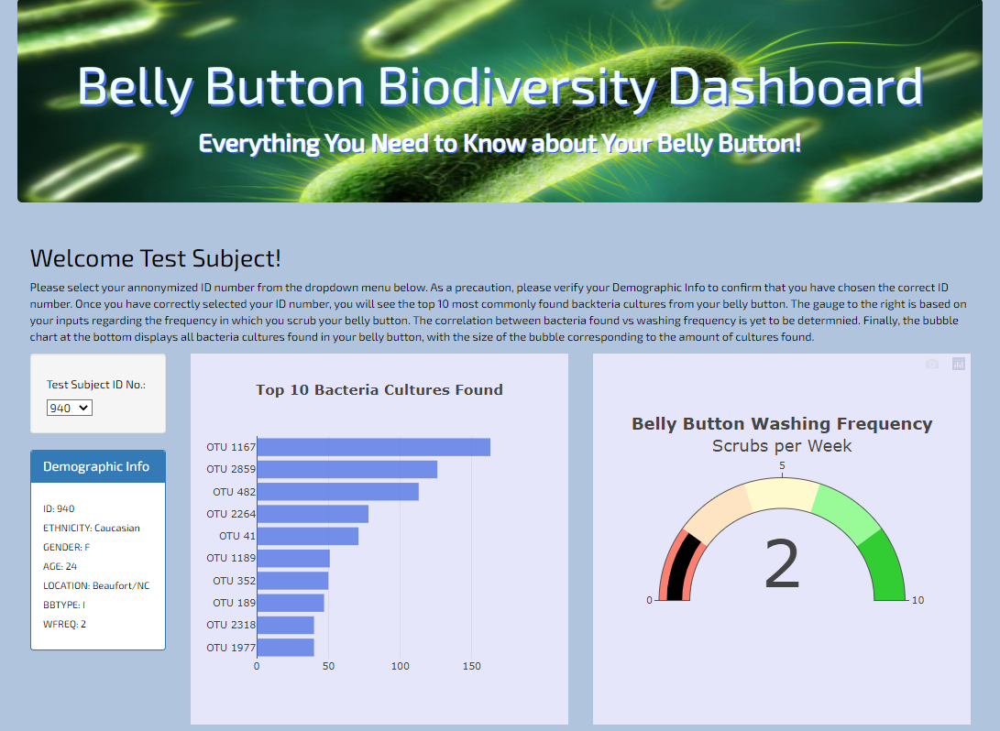

# Interactive Data Visualizations

## Overview:
Create an interactive dashboard which generates dynamic, customizable visualizations with Plotly.js. Data is retrieved from an external JSON file, and data manipulations are performed "under the hood" in JavaScript using `function`(including annonymous 'arrow' (`=>`) functions), `for` loops, `if` and `else if` conditionals, and `.filter()`, `.sort()`, `.map()`, and `.slice*()` methods. JavaScript event listeners (D3.js) are used to dynamically update the visualizations based on user inputs.

### Homepage:
#### Bar chart and Gauge generated with Plotly.js

#### Bubble chart generated with Plotly.js

## Tools:
- HTML with Bootstrap
- JavaScript with D3 and Plotly
- CSS for basic style edits